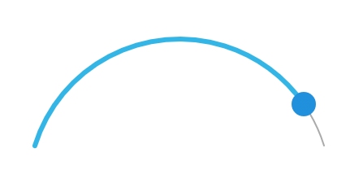
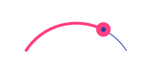

# ArcSeekBar

Library was created to make good looking curved SeekBars.

[](https://jitpack.io/#marcinmoskala/ArcSeekBar)
[](https://github.com/MarcinMoskala/ArcSeekBar)
[](https://github.com/MarcinMoskala/ArcSeekBar)

To stay up-to-date with news about library [](https://twitter.com/marcinmoskala?ref_src=twsrc%5Etfw)

## Usage

Library can be used to make good-looking curved SeekBar:
 


Here are some usage examples:



```xml
<com.marcinmoskala.arcseekbar.ArcSeekBar
    android:layout_width="300dp"
    android:layout_height="150dp" />
```



```xml
<com.marcinmoskala.arcseekbar.ArcSeekBar
    app:thumb="@drawable/thumb2"
    app:progressColor="@color/colorAccent"
    app:progressBackgroundColor="@color/colorPrimary"
    android:layout_width="200dp"
    android:layout_height="100dp" />
```

[Here](https://github.com/MarcinMoskala/ArcSeekBar/blob/master/app/src/main/res/drawable/thumb2.xml) is progress drawable `thumb2` definition.


```xml
<com.marcinmoskala.arcseekbar.ArcSeekBar
    android:id="@+id/seekArc"
    android:layout_width="match_parent"
    android:layout_height="100dp"
    app:progressBackgroundColor="@color/sliderBack"
    app:progressBackgroundWidth="20dp"
    app:progress="100"
    app:progressWidth="20dp"
    app:roundEdges="true" />
```

To make gradient, you need to define it in code:

```java
int[] intArray = getResources().getIntArray(R.array.progressGradientColors);
arcSeekBar.setProgressGradient(intArray);
```

[Here](https://github.com/MarcinMoskala/ArcSeekBar/blob/master/app/src/main/res/values/colors.xml) you can find array definition.

## Customization

ArcSeekBar properties are:
* `thumb` - reference to thumb drawable.
* `progress` - initial value of progress (0 by default).
* `maxProgress` max vale of progress (100 by default).
* `progressColor` color of visible progress bar.
* `progressWidth` width of visible progress bar.
* `progressBackgroundColor` color of bar behind progress.
* `progressBackgroundWidth` width of bar behind progress.
* `roundEdges` if edges should be rounded or not (`true` by default).
* `enabled` is progress enabled or not (`true` by default). For disabled there is no thumb displayed.

Each property can be changes pragmatically, and additionally gradient progress or background can be set by:
* `setProgressGradient` e.g. `arcSeekBar.setProgressGradient(Color.GREEN, Color.BLUE, Color.YELLOW);`
* `setProgressBackgroundGradient` e.g. `arcSeekBar.setProgressBackgroundGradient(Color.GREEN, Color.BLUE, Color.YELLOW);`

## Installation

Just add following dependency in your module `build.gradle`:

```groovy
dependencies {
    compile 'com.github.marcinmoskala:ArcSeekBar:0.31'
}
```

Also add on your module `build.gradle` (unless you already have it):

```groovy
repositories {
    maven { url 'https://jitpack.io' }
}
```

## Other libraries

If you like it, remember to leave the star and check out my other libraries:
 * [VideoPlayView](https://github.com/MarcinMoskala/VideoPlayView) - Custom Android view with video player, loader and placeholder image
 * [ActivityStarter](https://github.com/MarcinMoskala/ActivityStarter/blob/master/README.md) - Simple Android Library, that provides easy way to start and save state of Activities, Fragments, Services and Receivers with arguments.
 * [PreferenceHolder](https://github.com/MarcinMoskala/PreferenceHolder) - Library for simple SharedPreference management in Kotlin
 * [KotlinAndroidViewBindings](https://github.com/MarcinMoskala/KotlinAndroidViewBindings) - Bindings for properties with simple Kotlin types (Boolean, String) to layout traits (visibility, text).

License
-------

    Copyright 2017 Marcin Moskała

    Licensed under the Apache License, Version 2.0 (the "License");
    you may not use this file except in compliance with the License.
    You may obtain a copy of the License at

       http://www.apache.org/licenses/LICENSE-2.0

    Unless required by applicable law or agreed to in writing, software
    distributed under the License is distributed on an "AS IS" BASIS,
    WITHOUT WARRANTIES OR CONDITIONS OF ANY KIND, either express or implied.
